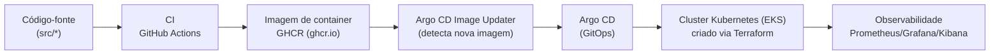

# Aula 01 — Fundamentos de DevOps e GitOps

[⬅ Índice](00-indice.md) | [Próxima aula ➡](02-arquitetura-da-aplicacao.md)

## Objetivos

- Entender o que é DevOps além do "buzzword" e por que ele existe.
- Entender os pilares: Integração Contínua (CI), Entrega/Implantação Contínua (CD),
  Infraestrutura como Código (IaC) e GitOps.
- Ter uma visão panorâmica de como este repositório implementa todos esses pilares.

## Conceito

### O problema que o DevOps resolve

Antes do DevOps, times de **Desenvolvimento** (que criam features) e **Operações** (que mantêm
sistemas no ar) trabalhavam separados, com objetivos que pareciam conflitantes: dev quer lançar
rápido, ops quer estabilidade. Isso gerava deploys manuais, lentos, arriscados e cheios de
"funciona na minha máquina".

**DevOps** é uma cultura e um conjunto de práticas que unem esses dois mundos com automação,
para entregar software com mais velocidade **e** mais confiabilidade ao mesmo tempo.

### Os pilares que este projeto usa



1. **Infraestrutura como Código (IaC)** — em vez de clicar no console da AWS, toda a infra
   (VPC, EKS, bastion) é descrita em arquivos `.tf` versionados em [terraform/](../../terraform).
   Ver aula 05.
2. **Integração Contínua (CI)** — a cada `push` em `src/**`, o GitHub Actions builda a imagem
   Docker, roda um scan de segurança (Trivy) e publica no GitHub Container Registry (GHCR).
   Ver aula 10.
3. **Entrega Contínua (CD) via GitOps** — o **Argo CD** observa o repositório Git e mantém o
   cluster sempre igual ao que está descrito em Git (`syncPolicy.automated`). Não existe
   `kubectl apply` manual em produção. Ver aulas 09 e 11.
4. **Observabilidade** — métricas (Prometheus/Grafana), logs (Elastic/Kibana) e alertas (Slack)
   para saber se o sistema está saudável. Ver aulas 12 e 13.
5. **Confiabilidade e escala** — autoscaling (HPA) e, opcionalmente, service mesh (Istio).
   Ver aulas 14 e 15.

### O que é GitOps, especificamente

GitOps é uma forma de fazer CD onde:

- O **Git é a única fonte da verdade** do estado desejado do cluster.
- Um **agente dentro do cluster** (aqui, o Argo CD) puxa (`pull`) as mudanças do Git — em vez
  de um pipeline externo empurrar (`push`) comandos `kubectl` para o cluster.
- O agente **reconcilia continuamente**: se alguém alterar algo manualmente no cluster
  (`kubectl edit`), o GitOps detecta o "drift" (desvio) e desfaz a mudança, voltando ao que
  está no Git (`selfHeal`).

Isso é exatamente o que você vai ver na aula 09, no arquivo
[argocd/argocd-apps/boutique-app.yaml](../../argocd/argocd-apps/boutique-app.yaml):

```yaml
syncPolicy:
  automated:
    prune: true
    selfHeal: true
  syncOptions:
  - CreateNamespace=true
```

- `selfHeal: true` → qualquer mudança manual no cluster é revertida automaticamente.
- `prune: true` → recursos removidos do Git são removidos do cluster.
- Isso é reforçado depois na aula 14: se você tentar escalar manualmente via `kubectl edit`,
  o Argo CD desfaz a mudança — a forma correta é editar o Helm values e dar commit/push.

### Por que este projeto é um ótimo laboratório

Este repositório é um fork do **Online Boutique** (demo de microsserviços do Google),
estendido com uma esteira completa "produção-like" na AWS:

- Terraform provisionando VPC + EKS + bastion.
- AWS Load Balancer Controller + Gateway API (Kubernetes) expondo os serviços via ALB.
- External DNS criando registros DNS automaticamente no Route 53.
- Helm empacotando a aplicação e Kustomize compondo variações/infra extra.
- Argo CD + Argo CD Image Updater fechando o ciclo GitOps.
- GitHub Actions fazendo CI com scan de segurança.
- Stack de observabilidade completa (métricas + logs + alertas).

Você vai construir/entender esse pipeline peça por peça, na mesma ordem em que ele foi
montado.

## Na prática, neste repositório

Dê uma primeira olhada na estrutura de alto nível (sem entrar em detalhes ainda — isso vem
nas próximas aulas):

| Pasta | O que é | Aula |
|-------|---------|------|
| `src/` | Código-fonte dos 11 microsserviços | 02, 03 |
| `kubernetes-manifests/` | Manifests K8s "crus" | 04 |
| `terraform/` | Infraestrutura AWS (VPC, EKS, bastion) | 05 |
| `gateway-api-manifests/`, `external-dns/` | Rede/ingress na AWS | 06 |
| `kustomize/` | Composição/variações de manifests | 07 |
| `helm-chart/` | Empacotamento da aplicação | 08 |
| `argocd/` | GitOps (Argo CD + Image Updater) | 09, 11 |
| `.github/workflows` (documentado no `README.md`) | Pipeline de CI | 10 |
| `observability/` | Métricas e logs | 12, 13 |
| `scaling/` | Autoscaling | 14 |
| `istio-manifests/` | Service mesh | 15 |

> [!IMPORTANTE]
> O [README.md](../../README.md) da raiz é, na prática, o "diário de bordo" completo do autor
> montando essa plataforma do zero na AWS — com todos os comandos, prints e decisões. Este
> curso reorganiza e explica esse mesmo conteúdo de forma didática e sequencial. Sempre que
> quiser o passo a passo bruto de comandos, o README é a referência complementar.

## Checklist

- [ ] Eu sei explicar a diferença entre CI e CD.
- [ ] Eu sei explicar o que torna um pipeline "GitOps" (pull + reconciliação contínua) e em
      que ele difere de um pipeline CD tradicional (push de `kubectl apply` via Jenkins, por
      exemplo).
- [ ] Eu consigo apontar, na estrutura de pastas deste repo, onde fica IaC, CI, CD/GitOps e
      observabilidade.

## Próxima aula

[Aula 02 — Arquitetura da aplicação ➡](02-arquitetura-da-aplicacao.md)
