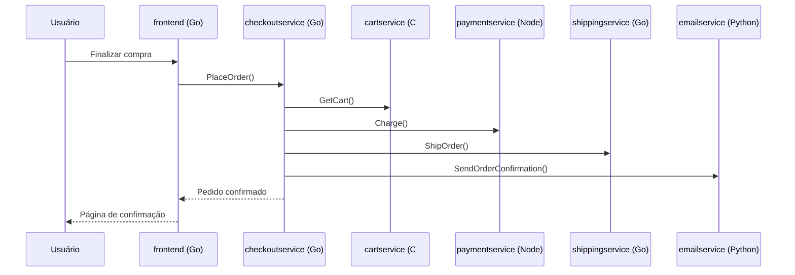

# Aula 02 — Arquitetura da aplicação (Online Boutique)

[⬅ Aula anterior](01-fundamentos-devops-e-gitops.md) | [Índice](00-indice.md) | [Próxima aula ➡](03-containers-e-docker.md)

## Objetivos

- Entender o que é uma arquitetura de microsserviços e compará-la com um monólito.
- Conhecer os 11 microsserviços do Online Boutique, suas linguagens e responsabilidades.
- Entender como os serviços se comunicam (gRPC + Protocol Buffers) e como os dados fluem.
- Entender por que a maioria dos serviços é "stateless" (sem estado).

## Conceito

### Monólito vs. Microsserviços

Um **monólito** é uma aplicação única, com todo o código em um só processo/deploy. É simples
no início, mas difícil de escalar em equipe e em infraestrutura: um bug em "carrinho de
compras" pode derrubar o checkout inteiro; para escalar o catálogo de produtos, você precisa
escalar a aplicação inteira.

**Microsserviços** dividem a aplicação em serviços pequenos e independentes, cada um:

- Responsável por **uma função de negócio** (carrinho, pagamento, frete...).
- **Implantado e escalado independentemente**.
- Falha **isolada** — se o `emailservice` cair, o resto da loja continua funcionando.

O custo é a complexidade operacional: agora você tem 11 aplicações para buildar, versionar,
implantar, monitorar e conectar entre si — exatamente o motivo pelo qual as próximas aulas
(Kubernetes, Helm, ArgoCD, observabilidade) existem.

### Os 11 microsserviços

| Serviço | Linguagem | Responsabilidade |
|---|---|---|
| [frontend](../../src/frontend) | Go | Serve o site (HTTP), gera sessão de usuário automaticamente (sem login). |
| [cartservice](../../src/cartservice) | C# | Carrinho de compras, persistido em **Redis**. |
| [productcatalogservice](../../src/productcatalogservice) | Go | Lista/busca produtos a partir de um JSON estático. |
| [currencyservice](../../src/currencyservice) | Node.js | Converte valores entre moedas (serviço de maior QPS). |
| [paymentservice](../../src/paymentservice) | Node.js | "Cobra" o cartão (mock) e retorna um ID de transação. |
| [shippingservice](../../src/shippingservice) | Go | Estima custo de frete e "envia" o pedido (mock). |
| [emailservice](../../src/emailservice) | Python | Envia e-mail de confirmação de pedido (mock). |
| [checkoutservice](../../src/checkoutservice) | Go | Orquestra o pedido: chama cart, payment, shipping e email. |
| [recommendationservice](../../src/recommendationservice) | Python | Recomenda produtos com base no carrinho. |
| [adservice](../../src/adservice) | Java | Retorna anúncios de texto com base em contexto. |
| [loadgenerator](../../src/loadgenerator) | Python/Locust | Gera tráfego sintético simulando usuários reais. |

Cada pasta em [src/](../../src) tem seu próprio `Dockerfile`, arquivo de dependências
(`go.mod`, `package.json`, `requirements.txt`, `.csproj`) e código-fonte — ou seja, cada
serviço é **buildado e versionado de forma independente**. Isso é a base para o pipeline de
CI da aula 10, que builda **só o serviço que mudou**.

### Comunicação entre serviços: gRPC + Protocol Buffers

Os serviços conversam entre si por **gRPC**, um protocolo de RPC (chamada remota de
procedimento) binário e eficiente, baseado em HTTP/2. Os contratos (quais métodos existem,
quais campos cada mensagem tem) ficam definidos em um único arquivo:
[protos/demo.proto](../../protos/demo.proto).

Exemplo real do arquivo (serviço de carrinho):

```protobuf
service CartService {
    rpc AddItem(AddItemRequest) returns (Empty) {}
    rpc GetCart(GetCartRequest) returns (Cart) {}
    rpc EmptyCart(EmptyCartRequest) returns (Empty) {}
}

message CartItem {
    string product_id = 1;
    int32  quantity = 2;
}
```

Cada linguagem gera, a partir desse `.proto`, um "client stub" e um "server stub" tipados —
por isso o Go chama o C# (cartservice) como se fosse uma função local, sem se preocupar com
serialização JSON/HTTP manual. Isso também padroniza o contrato entre os times/serviços, algo
essencial quando cada serviço pode ser escrito em uma linguagem diferente.

Fluxo típico de uma compra:



### Persistência de dados (por que quase tudo é "stateless")

| Serviço | Tem persistência? | Onde |
|---|---|---|
| cartservice | ✅ Sim | Redis |
| Todos os outros | ❌ Não | Em memória / mock / arquivo estático |

O projeto guarda **estado real apenas no carrinho** (Redis). Todo o resto — catálogo de
produtos, recomendações, pagamento, frete, e-mail — é **stateless** (sem estado) ou usa dados
estáticos carregados em memória.

Isso é uma decisão de design intencional: manter a demo simples, sem precisar gerenciar bancos
de dados, e colocar o foco de aprendizado nas preocupações de **plataforma** — o que este curso
ensina: CI/CD, redes, observabilidade e escalabilidade.

> [!IMPORTANTE]
> Serviços stateless são **muito mais fáceis de escalar horizontalmente** (basta rodar mais
> réplicas idênticas — ver aula 14, HPA) e mais fáceis de atualizar sem downtime (basta trocar
> o Pod, não há dado para migrar). Serviços com estado (como o Redis do carrinho) exigem
> estratégias diferentes (volumes persistentes, backups, réplicas com dados sincronizados).

## Na prática, neste repositório

1. Abra [src/](../../src) e escolha 2 ou 3 serviços de linguagens diferentes (ex.: `frontend`
   em Go, `emailservice` em Python, `cartservice` em C#). Repare que cada um tem seu próprio
   `Dockerfile` — cada serviço é independente.
2. Abra [protos/demo.proto](../../protos/demo.proto) e encontre a definição do
   `CheckoutService` — ele é o "orquestrador" do fluxo de compra.
3. Leia a seção "Architecture" do [README.md](../../README.md) raiz para ver a tabela oficial
   de serviços com o diagrama de arquitetura.

## Checklist

- [ ] Eu sei listar pelo menos 5 dos 11 microsserviços e sua responsabilidade.
- [ ] Eu entendo por que gRPC + Protocol Buffers facilita a comunicação entre serviços escritos
      em linguagens diferentes.
- [ ] Eu sei explicar por que só o `cartservice` precisa de armazenamento persistente.

## Próxima aula

[Aula 03 — Containers e Docker ➡](03-containers-e-docker.md)
