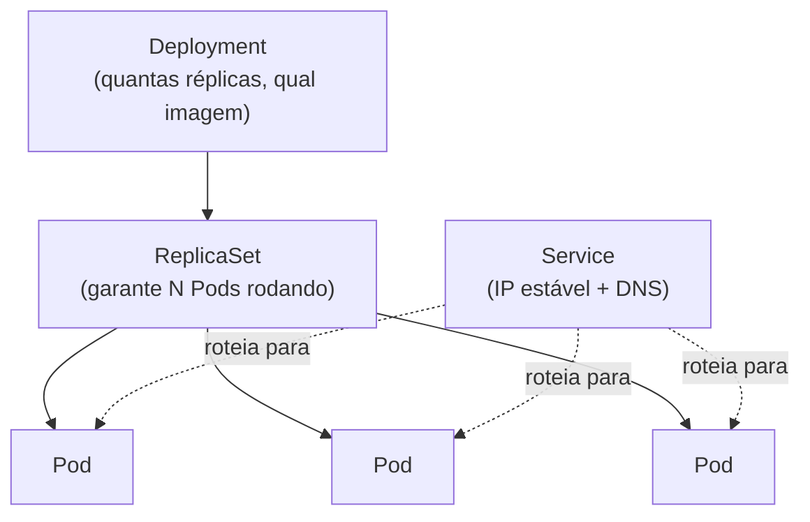

# Aula 04 — Fundamentos de Kubernetes

[⬅ Aula anterior](03-containers-e-docker.md) | [Índice](00-indice.md) | [Próxima aula ➡](05-terraform-infraestrutura-como-codigo.md)

## Objetivos

- Entender por que containers sozinhos não bastam em produção — e o papel do Kubernetes.
- Entender os objetos essenciais: Pod, Deployment, Service, ServiceAccount.
- Ler e interpretar o manifest real do `frontend` deste projeto.
- Entender `resources` (requests/limits) e probes de saúde (readiness/liveness).

## Conceito

### Por que Kubernetes?

Um único `docker run` não responde a perguntas como: *"o que acontece se o container morrer?"*,
*"como eu rodo 5 réplicas do mesmo serviço?"*, *"como um serviço descobre o endereço de
outro?"*, *"como eu faço rolling update sem downtime?"*.

**Kubernetes (K8s)** é um orquestrador de containers: ele decide *onde* rodar cada container,
reinicia containers que falham, distribui carga entre réplicas, e fornece descoberta de
serviço (DNS interno) entre eles.

### Objetos essenciais



- **Pod**: a menor unidade executável do Kubernetes — um ou mais containers que compartilham
  rede e storage. Pods são efêmeros (podem morrer e ser recriados a qualquer momento, com IP
  novo).
- **Deployment**: declara *quantas réplicas* de um Pod devem existir e *qual imagem* rodar.
  O Deployment cria um `ReplicaSet`, que garante que o número de Pods desejado esteja sempre
  rodando (recria Pods que morrem). Também gerencia rolling updates.
- **Service**: um endereço de rede **estável** (IP + nome DNS) na frente de um grupo de Pods
  (selecionados por `label selector`). Como Pods vêm e vão, o Service é o que permite outros
  serviços se conectarem de forma confiável, sem saber o IP de cada Pod.
- **ServiceAccount**: identidade que o Pod usa para se autenticar na API do Kubernetes (e,
  às vezes, em provedores de nuvem via IAM — ver aula 06).

### Descoberta de serviço via DNS interno

Um dos "superpoderes" invisíveis do Kubernetes: todo `Service` ganha automaticamente um nome
DNS interno igual ao seu `metadata.name`. É por isso que, no manifest do `frontend`, o
endereço do serviço de catálogo é simplesmente `productcatalogservice:3550` — sem IP fixo,
sem descoberta manual.

### Probes de saúde: readiness e liveness

- **readinessProbe**: "este Pod está pronto para receber tráfego?" Se falhar, o Service para
  de rotear tráfego para ele (mas o Pod continua rodando).
- **livenessProbe**: "este Pod ainda está vivo/saudável?" Se falhar, o Kubernetes **reinicia**
  o container.

Isso evita dois problemas comuns: enviar tráfego para um Pod que ainda está inicializando, e
deixar um Pod travado (mas "rodando") recebendo tráfego para sempre.

### `resources`: requests e limits

- **requests**: quanto de CPU/memória o Pod *reserva* — usado pelo Kubernetes para decidir em
  qual nó agendar o Pod, e é a base do cálculo de autoscaling (aula 14).
- **limits**: o teto máximo que o container pode consumir — protege o nó de um único container
  "engolir" todos os recursos.

## Na prática, neste repositório

Abra [kubernetes-manifests/frontend.yaml](../../kubernetes-manifests/frontend.yaml) — é o
manifest "cru" (sem Helm, sem Kustomize) do serviço `frontend`. Nele você encontra, em um único
arquivo, três objetos separados por `---`:

**1. Deployment** — define a réplica, a imagem, variáveis de ambiente (endereços dos outros
serviços via DNS interno) e configurações de segurança:

```yaml
securityContext:
  fsGroup: 1000
  runAsGroup: 1000
  runAsNonRoot: true      # nunca roda como root dentro do container
  runAsUser: 1000
containers:
  - name: server
    securityContext:
      allowPrivilegeEscalation: false
      capabilities:
        drop: ["ALL"]      # remove todas as capabilities do Linux desnecessárias
      readOnlyRootFilesystem: true   # filesystem raiz é somente leitura
```

> [!IMPORTANTE]
> Essas configurações de `securityContext` são um exemplo real de **hardening** de container:
> rodar sem privilégios de root, sem poder escalar privilégios, e com filesystem raiz
> imutável reduz drasticamente o que um atacante consegue fazer mesmo se comprometer o
> processo da aplicação. Vamos revisitar isso na aula 16 (Segurança).

**2. Service (`ClusterIP`)** — expõe o `frontend` **internamente** no cluster, na porta 80:

```yaml
apiVersion: v1
kind: Service
metadata:
  name: frontend
spec:
  type: ClusterIP
  ports:
  - port: 80
    targetPort: 8080
```

**3. Service (`frontend-external`, `LoadBalancer`)** — expõe o `frontend` para fora do cluster
(este projeto substitui esse padrão pela Gateway API + ALB, que veremos na aula 06 — mais
flexível que um `LoadBalancer` simples por serviço).

**4. ServiceAccount** — identidade dedicada do Pod `frontend` (usada por Istio/AuthorizationPolicy
mais adiante, aula 15).

### Explore os outros serviços

Compare o manifest do `frontend` com o de outro serviço, por exemplo
[kubernetes-manifests/cartservice.yaml](../../kubernetes-manifests/cartservice.yaml). Repare
que a estrutura (Deployment + Service + ServiceAccount) se repete — é um padrão consistente
em todo o projeto.

### Mão na massa (cluster local, opcional)

Se quiser sentir esses conceitos na prática antes de ir para AWS/EKS (aula 05), você pode
subir um cluster local (Kind ou Minikube) e aplicar só os manifests puros:

```bash
kind create cluster
kubectl apply -f kubernetes-manifests/
kubectl get pods
kubectl get svc
kubectl port-forward deployment/frontend 8080:8080
# acesse http://localhost:8080
```

Isso é exatamente o fluxo descrito em [docs/development-guide.md](../development-guide.md)
(que usa `skaffold` para automatizar build + deploy local).

## Checklist

- [ ] Eu sei a diferença entre Pod, Deployment e Service.
- [ ] Eu sei explicar por que Services têm DNS interno estável mesmo com Pods sendo recriados.
- [ ] Eu sei a diferença entre `readinessProbe` e `livenessProbe`.
- [ ] Eu sei a diferença entre `requests` e `limits` de recursos.
- [ ] Eu identifiquei, no manifest do `frontend`, as configurações de `securityContext`.

## Próxima aula

[Aula 05 — Terraform: Infraestrutura como Código ➡](05-terraform-infraestrutura-como-codigo.md)
