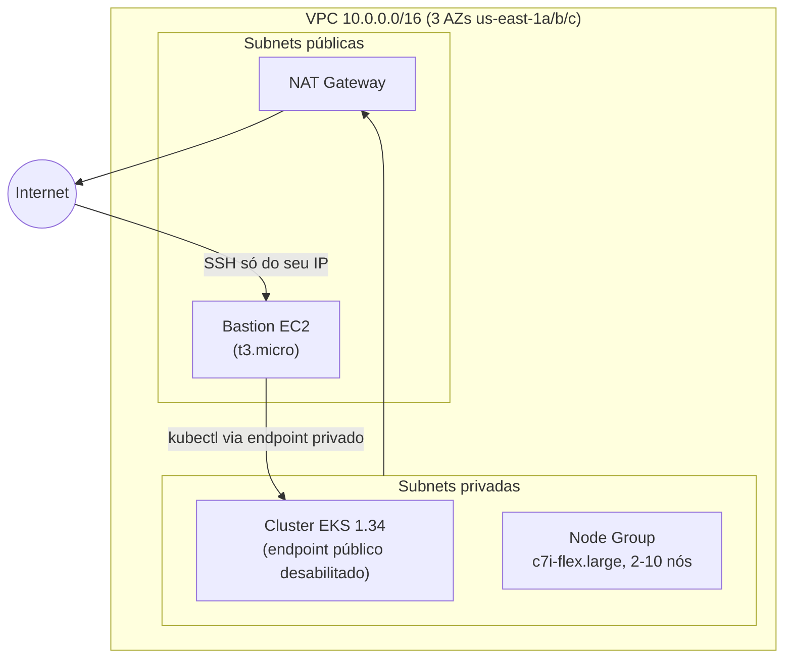

# Aula 05 — Terraform: Infraestrutura como Código

[⬅ Aula anterior](04-fundamentos-kubernetes.md) | [Índice](00-indice.md) | [Próxima aula ➡](06-acesso-cluster-loadbalancer-gateway-api.md)

## Objetivos

- Entender o que é Infraestrutura como Código (IaC) e por que ela substitui cliques no console.
- Entender os conceitos de Terraform: provider, module, resource, state, backend remoto.
- Ler e entender cada arquivo `.tf` deste projeto: VPC, EKS, bastion host.
- Aplicar a infraestrutura na AWS (opcional, gera custo) e entender o `terraform.tfstate`.

## Conceito

### O que é Infraestrutura como Código

Antes de IaC, criar um cluster Kubernetes na AWS significava abrir o console, clicar em
dezenas de telas (VPC, subnets, roteamento, IAM, cluster, node groups...), anotar em algum
lugar o que foi feito — e torcer para lembrar como refazer em outro ambiente.

**IaC** descreve essa infraestrutura em arquivos de texto versionáveis (aqui, `.tf` do
Terraform). Vantagens:

- **Repetível**: `terraform apply` recria o ambiente inteiro de forma idêntica.
- **Revisável**: mudanças de infraestrutura passam por Pull Request/code review, como código.
- **Documentado por definição**: o arquivo `.tf` *é* a documentação de como a infra é montada.
- **Rastreável**: o Terraform mantém um **state** (estado) que sabe o que já existe, o que
  precisa mudar e o que precisa ser destruído.

### Conceitos-chave do Terraform

- **Provider**: o "plugin" que fala com uma API específica (aqui, `hashicorp/aws`).
- **Resource**: uma peça de infraestrutura gerenciada (uma VPC, uma instância EC2...).
- **Module**: um conjunto reutilizável de resources — em vez de escrever toda uma VPC do zero,
  este projeto usa o módulo público `terraform-aws-modules/vpc/aws`.
- **State**: um arquivo (`terraform.tfstate`) que mapeia "o que o Terraform acha que existe"
  para os recursos reais na nuvem. Por padrão fica local; pode (e deve, em equipe) ficar em
  um **backend remoto** (aqui, S3), para evitar conflitos entre pessoas.
- **Plan / Apply**: `terraform plan` mostra o que vai mudar *antes* de mudar; `terraform apply`
  executa.

### A infraestrutura deste projeto



## Na prática, neste repositório

Todos os arquivos ficam em [terraform/](../../terraform). Vamos ler cada um.

### 1. `terraform.tf` — providers e backend

```hcl
terraform {
  required_providers {
    aws = {
      source  = "hashicorp/aws"
      version = "6.28.0"
    }
  }
}

provider "aws" {
  region = "us-east-1"
}
```

Fixar a versão do provider (`6.28.0`) evita que uma atualização do provider quebre seu código
sem aviso — uma boa prática de IaC.

### 2. `vpc.tf` — a rede

```hcl
module "vpc" {
  source = "terraform-aws-modules/vpc/aws"

  name = "test-vpc-01"
  cidr = "10.0.0.0/16"

  azs             = ["us-east-1a", "us-east-1b", "us-east-1c"]
  private_subnets = ["10.0.1.0/24", "10.0.2.0/24", "10.0.3.0/24"]
  public_subnets  = ["10.0.101.0/24", "10.0.102.0/24", "10.0.103.0/24"]

  enable_nat_gateway = true
  single_nat_gateway = true
}
```

Em vez de escrever manualmente route tables, internet gateway e NAT gateway, este projeto usa
o **módulo comunitário** `terraform-aws-modules/vpc/aws` — prática comum: reutilizar módulos
testados pela comunidade em vez de reinventar. As tags
`kubernetes.io/role/elb` / `internal-elb` nas subnets são o que permite ao AWS Load Balancer
Controller (aula 06) descobrir automaticamente onde criar load balancers.

> [!IMPORTANTE]
> `single_nat_gateway = true` usa **um único** NAT Gateway para as 3 zonas de disponibilidade
> (mais barato). Em produção real, o recomendado é um NAT Gateway por AZ (mais resiliente,
> mas mais caro) — uma troca clássica de custo vs. disponibilidade que você vai encontrar
> sempre em decisões de infraestrutura.

### 3. `eks.tf` — o cluster Kubernetes gerenciado

```hcl
module "eks" {
  source  = "terraform-aws-modules/eks/aws"
  version = "~> 21.0"

  name               = "terraform-cluster"
  kubernetes_version = "1.34"

  endpoint_public_access = false   # a API do cluster só é acessível de dentro da VPC
  enable_cluster_creator_admin_permissions = true

  eks_managed_node_groups = {
    example = {
      ami_type       = "AL2023_x86_64_STANDARD"
      instance_types = ["c7i-flex.large"]
      min_size     = 2
      max_size     = 10
      desired_size = 2
    }
  }
}
```

Alguns pontos que valem entendimento profundo:

- **`endpoint_public_access = false`**: o endpoint da API do Kubernetes **não é exposto na
  internet pública** — só é alcançável de dentro da VPC. É por isso que este projeto precisa
  de um **bastion host** (próximo arquivo) para rodar `kubectl`. Isso é uma prática de
  segurança: reduz drasticamente a superfície de ataque do plano de controle.
- **`eks_managed_node_groups`**: define o Auto Scaling Group de instâncias EC2 (os "nós"/
  workers) onde os Pods realmente rodam — `min_size`/`max_size`/`desired_size` controlam
  quantas máquinas existem (isto é escala de **infraestrutura**, diferente do HPA da aula 14,
  que escala **Pods** dentro da capacidade já existente).
- **`addons`**: `coredns`, `kube-proxy`, `vpc-cni` e `eks-pod-identity-agent` são componentes
  gerenciados pela AWS que o EKS precisa para funcionar (DNS interno, rede de Pods, proxy de
  rede, e — importante — o Pod Identity Agent, usado depois pelo External DNS na aula 06 para
  dar permissões de IAM a Pods sem gerenciar chaves de acesso).

### 4. `bastion-ec2.tf` — acesso administrativo seguro

Como o endpoint do EKS é privado, o projeto cria uma instância "ponte" (bastion) para acessar
o cluster:

```hcl
resource "aws_security_group" "bastion_sg" {
  ingress {
    from_port   = 22
    to_port     = 22
    protocol    = "tcp"
    cidr_blocks = ["${chomp(data.http.my_ip.response_body)}/32"]  # só o SEU IP atual
  }
}
```

Repare no truque: `data.http.my_ip` faz uma requisição HTTP para `checkip.amazonaws.com`
durante o `terraform apply`, pega o IP público de quem está rodando o Terraform, e libera SSH
**só para esse IP** (`/32` = um único endereço). Isso evita abrir SSH para `0.0.0.0/0`
(qualquer lugar da internet) — outra prática de segurança revisitada na aula 16.

O Terraform também gera o par de chaves SSH automaticamente:

```hcl
resource "tls_private_key" "bastion_key" {
  algorithm = "RSA"
  rsa_bits  = 4096
}
resource "local_file" "bastion_private_key" {
  content         = tls_private_key.bastion_key.private_key_pem
  filename        = "bastion-key.pem"
  file_permission = "0400"
}
```

> [!IMPORTANTE]
> `bastion-key.pem` é uma **credencial sensível** gerada localmente. Nunca faça commit desse
> arquivo no Git — confirme que ele está no `.gitignore`. Tratar segredos assim é um tema
> central da aula 16.

### 5. `outputs.tf` — o que o Terraform "devolve" após aplicar

```hcl
output "cluster_name"      { value = module.eks.cluster_name }
output "bastion_public_ip" { value = module.bastion_host.public_ip }
output "vpc_id"            { value = module.vpc.vpc_id }
```

Outputs são valores que você vai precisar logo depois — por exemplo, o IP do bastion para dar
`ssh`, e o nome do cluster para configurar o `kubectl` na aula 06.

### Executando (gera custo real na AWS)

```bash
cd terraform/
terraform init
terraform plan     # revise o que será criado
terraform apply    # confirme com "yes"
```

Ao final, os outputs mostram o IP do bastion. Para acessar:

```bash
ssh -i bastion-key.pem ubuntu@<IP_DO_BASTION>
```

### Backend remoto (opcional, recomendado em equipe)

Por padrão, o `terraform.tfstate` fica local. Para times, é melhor guardá-lo em um bucket S3
(versionado e criptografado), conforme documentado no [README.md](../../README.md):

```bash
aws s3api create-bucket --bucket <seu-bucket> --region us-east-1
aws s3api put-bucket-versioning --bucket <seu-bucket> --versioning-configuration Status=Enabled
```

E adicionar em `terraform.tf`:

```hcl
terraform {
  backend "s3" {
    bucket = "<seu-bucket>"
    key    = "s3-backend"
    region = "us-east-1"
  }
}
```

Depois, `terraform init` pergunta se você quer migrar o state local para o S3 — responda
`yes`.

## Checklist

- [ ] Eu sei explicar por que IaC é melhor do que clicar no console.
- [ ] Eu sei o que é o `terraform.tfstate` e por que ele deveria ficar em um backend remoto
      em um time.
- [ ] Eu sei explicar por que `endpoint_public_access = false` exige um bastion host.
- [ ] Eu sei explicar o truque de `data.http.my_ip` para restringir o SSH.
- [ ] Eu rodei (ou entendi, se não quiser gastar na AWS) `terraform plan`/`apply`.

## Próxima aula

[Aula 06 — Acesso ao cluster, Load Balancer e Gateway API ➡](06-acesso-cluster-loadbalancer-gateway-api.md)
