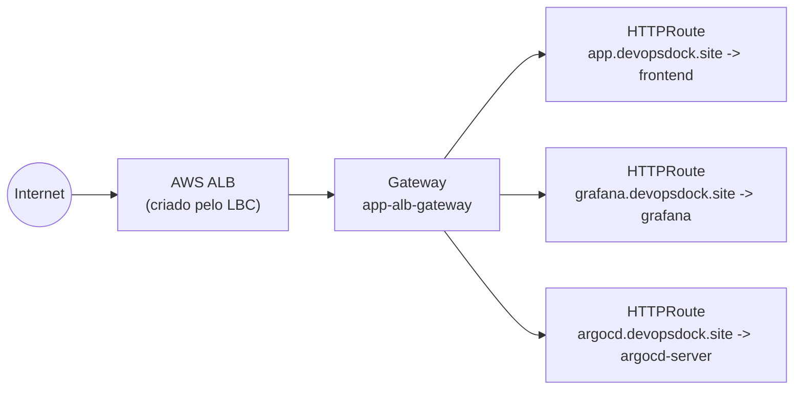

# Aula 06 — Acesso ao cluster, Load Balancer e Gateway API

[⬅ Aula anterior](05-terraform-infraestrutura-como-codigo.md) | [Índice](00-indice.md) | [Próxima aula ➡](07-kustomize-variacoes-de-deploy.md)

## Objetivos

- Configurar o `kubectl` para falar com o cluster EKS criado na aula 05.
- Entender o que é o AWS Load Balancer Controller e por que ele é necessário.
- Entender a Gateway API do Kubernetes e como ela substitui/evolui o `Ingress` tradicional.
- Entender o External DNS e como ele fecha o ciclo "criei um serviço -> ganhei um domínio".

## Conceito

### Do bastion ao `kubectl`

O EKS criado na aula 05 tem endpoint privado. De dentro do bastion (ou de qualquer máquina
com rede até a VPC), você autentica com a AWS e baixa o kubeconfig:

```bash
aws configure   # mesma access key/secret key usada pelo Terraform
aws eks update-kubeconfig --region us-east-1 --name terraform-cluster
kubectl get nodes
```

O comando `aws eks update-kubeconfig` não cria credenciais novas — ele gera um arquivo de
configuração local que diz ao `kubectl` **como** chamar o `aws eks get-token` toda vez que
precisar autenticar na API do cluster.

### Por que precisamos do AWS Load Balancer Controller?

Um `Service` do tipo `LoadBalancer` (visto na aula 04) até funciona, mas cada um cria um Load
Balancer **próprio** — caro e sem recursos avançados de roteamento HTTP (paths, hosts,
certificados TLS por hostname etc.).

O **AWS Load Balancer Controller (LBC)** é um controller que roda dentro do cluster e observa
objetos Kubernetes (Ingress, ou Gateway API) para **provisionar e configurar
Application/Network Load Balancers da AWS automaticamente**, de forma declarativa.

### Gateway API: a evolução do Ingress

O `Ingress` clássico do Kubernetes é limitado (spec pequena, extensões via anotações
específicas de cada controller, difícil de compor entre times). A **Gateway API** é o sucessor
oficial, com objetos mais expressivos e divididos por responsabilidade:

| Objeto | Responsabilidade | Quem mantém |
|---|---|---|
| `GatewayClass` | Qual controller/implementação vai atender (aqui, `gateway.k8s.aws/alb`) | Plataforma/infra |
| `Gateway` | Onde o tráfego entra: portas, protocolos, hostnames, certificados | Plataforma/infra |
| `HTTPRoute` | Para onde rotear (qual Service), baseado em path/host | Time de aplicação |

Essa separação é o ponto-chave: o time de **plataforma** cria e mantém o `Gateway` uma única
vez; cada time de **aplicação** só precisa criar seu próprio `HTTPRoute`, sem depender do time
de infra para cada novo serviço exposto.



### `TargetGroupConfiguration`: um detalhe específico da AWS

ALB/NLB da AWS têm um conceito que o Kubernetes não expressa nativamente: o **tipo de alvo**
do Target Group —

- `instance`: tráfego vai para os **nós EC2** (e o `kube-proxy` redireciona internamente).
- `ip`: tráfego vai **direto para o IP do Pod** (mais eficiente, contorna uma camada de rede).

Por isso o AWS Load Balancer Controller precisa de um CRD próprio,
`TargetGroupConfiguration`, para você declarar explicitamente `targetType: ip`. Esse CRD **só
existe/é necessário para o AWS LBC** — outros controllers de Gateway (Istio, NGINX, kgateway)
não precisam dele, porque não integram diretamente com Target Groups da AWS.

### External DNS: o último elo

Depois que o `Gateway`/ALB existe, alguém ainda precisa criar o registro DNS
(`app.devopsdock.site -> <endereço do ALB>`). O **External DNS** é um controller que observa
`Service`, `Ingress` e (nesta configuração) também `HTTPRoute`, e cria/atualiza registros
automaticamente no Route 53 — sem ninguém tocar no console de DNS manualmente.

## Na prática, neste repositório

### 1. Instalar o AWS Load Balancer Controller

```bash
eksctl utils associate-iam-oidc-provider --region us-east-1 --cluster terraform-cluster --approve

curl -O https://raw.githubusercontent.com/kubernetes-sigs/aws-load-balancer-controller/v2.14.1/docs/install/iam_policy.json
aws iam create-policy --policy-name AWSLoadBalancerControllerIAMPolicy --policy-document file://iam_policy.json

eksctl create iamserviceaccount \
    --cluster=terraform-cluster --namespace=kube-system --name=aws-load-balancer-controller \
    --attach-policy-arn=arn:aws:iam::<ACCOUNT_ID>:policy/AWSLoadBalancerControllerIAMPolicy \
    --approve

helm repo add eks https://aws.github.io/eks-charts
helm upgrade -i aws-load-balancer-controller eks/aws-load-balancer-controller \
  -n kube-system --set clusterName=terraform-cluster --set region=us-east-1 \
  --set vpcId=<VPC_ID> --set serviceAccount.create=false \
  --set serviceAccount.name=aws-load-balancer-controller \
  --set controllerConfig.featureGates.NLBGatewayAPI=true \
  --set controllerConfig.featureGates.ALBGatewayAPI=true \
  --version 3.0.0
```

### 2. Instalar os CRDs da Gateway API

```bash
kubectl apply -f https://github.com/kubernetes-sigs/gateway-api/releases/download/v1.3.0/standard-install.yaml
kubectl apply -f https://raw.githubusercontent.com/kubernetes-sigs/aws-load-balancer-controller/refs/heads/main/config/crd/gateway/gateway-crds.yaml
```

### 3. Criar a `GatewayClass`, a `LoadBalancerConfiguration` e o `Gateway`

Esses três arquivos já existem prontos em [gateway-api-manifests/](../../gateway-api-manifests):

[gateway-class.yaml](../../gateway-api-manifests/gateway-class.yaml):
```yaml
apiVersion: gateway.networking.k8s.io/v1beta1
kind: GatewayClass
metadata:
  name: aws-alb-gateway-class
spec:
  controllerName: gateway.k8s.aws/alb
```

[alb-config.yaml](../../gateway-api-manifests/alb-config.yaml) define o comportamento do ALB
(esquema `internet-facing`, certificado TLS na porta 443).

[gateway.yaml](../../gateway-api-manifests/gateway.yaml) cria o `Gateway` compartilhado
`app-alb-gateway`, com listeners HTTP (80) e HTTPS (443) para `*.devopsdock.site`.

```bash
kubectl apply -f gateway-api-manifests/gateway-class.yaml
kubectl apply -f gateway-api-manifests/alb-config.yaml
kubectl apply -f gateway-api-manifests/gateway.yaml
kubectl get gateway
```

### 4. Ver um `HTTPRoute` real deste projeto

[microservices-extra-kube-manifests/HTTProute.yaml](../../microservices-extra-kube-manifests/HTTProute.yaml)
conecta o hostname `app.devopsdock.site` ao Service `frontend`, reaproveitando o
`app-alb-gateway` criado acima:

```yaml
apiVersion: gateway.networking.k8s.io/v1beta1
kind: HTTPRoute
metadata:
  name: http-app-route
  namespace: boutique-app
spec:
  hostnames: ["app.devopsdock.site"]
  parentRefs:
  - kind: Gateway
    name: app-alb-gateway
    namespace: default
    sectionName: http
  rules:
  - backendRefs:
    - name: frontend
      port: 80
```

E o [target-grp.yaml](../../microservices-extra-kube-manifests/target-grp.yaml) que acompanha
(`targetType: ip`). Esse par (`HTTPRoute` + `TargetGroupConfiguration`) é o **padrão que se
repete** para expor qualquer serviço novo neste projeto (você vai ver o mesmo padrão para
Grafana, Prometheus e Kibana nas aulas 12/13).

### 5. Instalar o External DNS

```bash
kubectl create ns external-dns
eksctl create podidentityassociation \
  --cluster terraform-cluster --namespace external-dns --service-account-name external-dns \
  --role-name external-dns-pod-identity-role --permission-policy-arns $POLICY_ARN

helm repo add external-dns https://kubernetes-sigs.github.io/external-dns/
helm upgrade -i external-dns external-dns/external-dns \
  -f external-dns/external-dns-values-1.20.0.yaml -n external-dns --version 1.20.0
```

Repare em [external-dns/external-dns-values-1.20.0.yaml](../../external-dns/external-dns-values-1.20.0.yaml)
que os `sources` incluem `gateway-httproute` — é isso que ensina o External DNS a olhar para
`HTTPRoute` (Gateway API), não só `Service`/`Ingress` tradicionais. A permissão de IAM está em
[external-dns/policy.json](../../external-dns/policy.json), restrita só às ações
`route53:ChangeResourceRecordSets` / `ListResourceRecordSets` / `ListHostedZones` — princípio
do **menor privilégio** (ver aula 16).

> [!IMPORTANTE]
> Este setup usa **EKS Pod Identity** (o addon `eks-pod-identity-agent` criado na aula 05) em
> vez do método mais antigo, IRSA (IAM Roles for Service Accounts). Pod Identity é mais simples
> de configurar (não precisa anotar o ServiceAccount manualmente) — outra decisão de design
> que vale entender, não só copiar.

## Checklist

- [ ] Eu configurei o `kubectl` para falar com o EKS via `aws eks update-kubeconfig`.
- [ ] Eu sei explicar a diferença entre `GatewayClass`, `Gateway` e `HTTPRoute`.
- [ ] Eu sei por que o AWS LBC precisa de `TargetGroupConfiguration` e outros controllers não.
- [ ] Eu sei o que o External DNS faz e por que ele precisa ouvir `gateway-httproute`.

## Próxima aula

[Aula 07 — Kustomize: variações de deploy ➡](07-kustomize-variacoes-de-deploy.md)
