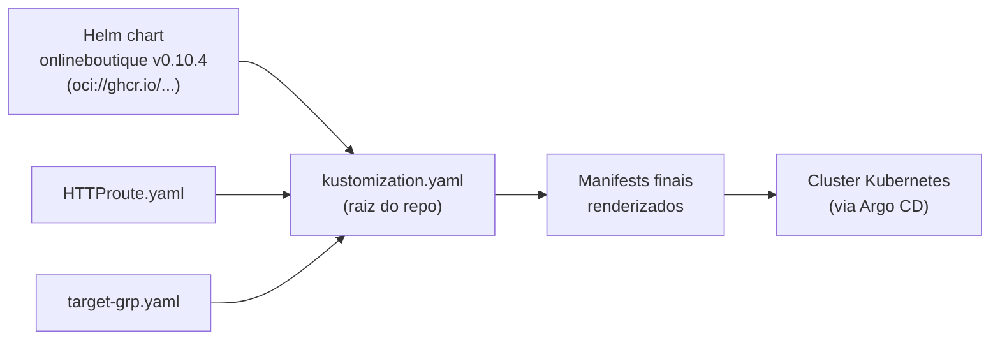

# Aula 07 — Kustomize: variações de deploy sem duplicação

[⬅ Aula anterior](06-acesso-cluster-loadbalancer-gateway-api.md) | [Índice](00-indice.md) | [Próxima aula ➡](08-helm-empacotando-a-aplicacao.md)

## Objetivos

- Entender o problema que o Kustomize resolve: customizar manifests sem copiar/colar.
- Entender `base` vs. `components` (overlays reutilizáveis e combináveis).
- Entender como o Kustomize também consegue "inflar" (renderizar) charts Helm.
- Entender o `kustomization.yaml` da raiz deste projeto — a peça central usada pelo ArgoCD.

## Conceito

### O problema: variações de manifests sem duplicar YAML

Imagine que você precisa do mesmo deploy do Online Boutique em três cenários: (1) puro, (2)
com branding customizado, (3) com Istio habilitado. Copiar e colar os YAMLs 3 vezes é um
pesadelo de manutenção — qualquer correção de bug precisaria ser replicada em 3 lugares.

**Kustomize** resolve isso com um modelo declarativo de **composição**: você tem uma `base`
(os manifests originais, sem alterações) e aplica **patches**/**components** por cima, sem
tocar nos arquivos originais. O resultado final é gerado (`kubectl kustomize .`), nunca
editado manualmente.

### `base` vs. `components`

- **`base/`**: os manifests "puros" do projeto — o ponto de partida comum a todas as variações.
- **`components/`**: pedaços de customização **independentes e combináveis**. Cada
  component resolve uma preocupação específica e pode ser somado a outros.

Neste projeto, [kustomize/components/](../../kustomize/components) tem, entre outros:

| Component | O que faz |
|---|---|
| `cymbal-branding` | Troca a marca visual da loja (variável de ambiente `CYMBAL_BRANDING`). |
| `google-cloud-operations` | Habilita métricas/tracing/profiler do Google Cloud. |
| `memorystore`, `spanner`, `alloydb` | Trocam o Redis do carrinho por um banco gerenciado na nuvem. |
| `network-policies` | Aplica `NetworkPolicy` restritiva por serviço. |
| `non-public-frontend` | Remove a exposição pública do `frontend`. |
| `service-mesh-istio` | Adiciona os recursos do Istio (aula 15). |
| `container-images-registry` / `-tag` / `-tag-suffix` | Trocam registry/tag das imagens — **usados por último**, pois reescrevem o que os outros components já geraram. |

O `kustomize/kustomization.yaml` mostra como combinar vários de uma vez:

```yaml
resources:
- base
components:
# - components/cymbal-branding
# - components/google-cloud-operations
# - components/service-mesh-istio
# These must be run last and in this order
# - components/container-images-tag
# - components/container-images-tag-suffix
# - components/container-images-registry
```

Descomentar linhas = ativar variações, sem duplicar nada. Você pode gerar o resultado
(sem aplicar) com:

```bash
cd kustomize/
kubectl kustomize .
```

E aplicar de fato com `kubectl apply -k .`.

> [!IMPORTANTE]
> O comentário "These must be run last and in this order" existe porque Kustomize aplica
> patches **na ordem declarada**. Trocar registry/tag de imagem só faz sentido depois que
> todos os outros manifests já foram compostos — outro exemplo de por que ler os comentários
> de um arquivo de configuração importa tanto quanto ler código.

### Kustomize também sabe "inflar" charts Helm

Uma capacidade menos conhecida (mas central neste projeto): o Kustomize pode combinar
manifests puros **com a renderização de um chart Helm**, através do bloco `helmCharts`. É
assim que o [kustomization.yaml](../../kustomization.yaml) da **raiz do repositório**
funciona — e é o arquivo que o ArgoCD usa como fonte da aplicação (próxima aula):

```yaml
apiVersion: kustomize.config.k8s.io/v1beta1
kind: Kustomization

resources:
  - microservices-extra-kube-manifests/HTTProute.yaml
  - microservices-extra-kube-manifests/target-grp.yaml

helmCharts:
  - name: onlineboutique
    repo: oci://ghcr.io/laxmikantagiri
    version: 0.10.4
    releaseName: boutique-app
    namespace: boutique-app
    valuesFile: helm-chart/values.yaml
```

Isto é elegante porque separa duas responsabilidades:

- **Helm** = "a aplicação" (o chart `onlineboutique`, reutilizável, publicado como pacote
  OCI — aula 08).
- **Kustomize (resources extras)** = "a camada de infraestrutura/rede específica deste
  ambiente" (`HTTPRoute`, `TargetGroupConfiguration`) — coisas que **não fazem parte** do
  chart genérico, porque são específicas do AWS Load Balancer Controller.



> [!IMPORTANTE]
> Suporte a Helm dentro do Kustomize é considerado um "plugin inseguro" por padrão (ele
> executa o binário `helm` durante o build) — por isso precisa ser habilitado explicitamente.
> No Argo CD, isso aparece na aula 09 como
> `configs.cm.kustomize.buildOptions: "--enable-helm"`.

### Por que não usar só Kustomize, ou só Helm?

- **Helm** brilha em **empacotar e versionar** uma aplicação inteira com parametrização
  (`values.yaml`) e distribuição (charts OCI/repos).
- **Kustomize** brilha em **compor variações** sem tocar no original e em colar peças
  adicionais (manifests que não fazem parte do chart) de forma declarativa.

Este projeto usa os dois, cada um resolvendo o problema que faz melhor — é um padrão comum em
GitOps do mundo real.

## Na prática, neste repositório

1. Rode `kubectl kustomize kustomize/` (sem aplicar) e observe o YAML final gerado combinando
   `base` com os components que estiverem descomentados.
2. Abra [kustomize/README.md](../../kustomize/README.md) para a lista completa de variações
   disponíveis e exemplos de `kustomize edit add component ...`.
3. Compare o `kustomize/kustomization.yaml` (variações da aplicação "pura") com o
   `kustomization.yaml` da **raiz** (usado pelo Argo CD, combinando Helm + manifests extra) —
   são dois usos diferentes da mesma ferramenta.

## Checklist

- [ ] Eu sei explicar a diferença entre `base` e `components` no Kustomize.
- [ ] Eu sei por que a ordem dos components de imagem (`tag`, `tag-suffix`, `registry`)
      importa.
- [ ] Eu sei explicar o que o `helmCharts` faz dentro de um `kustomization.yaml`.
- [ ] Eu sei por que o projeto separa "aplicação" (Helm) de "infraestrutura de rede"
      (`HTTPRoute`/`TargetGroupConfiguration` via Kustomize resources).

## Próxima aula

[Aula 08 — Helm: empacotando a aplicação ➡](08-helm-empacotando-a-aplicacao.md)
