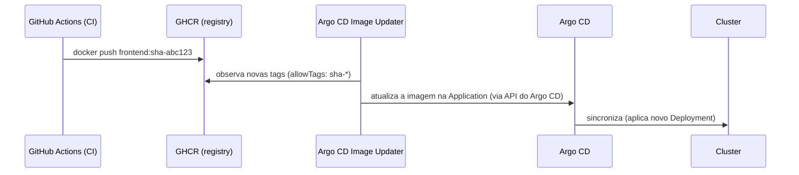

# Aula 11 — CD: fechando o loop com Argo CD Image Updater

[⬅ Aula anterior](10-ci-com-github-actions.md) | [Índice](00-indice.md) | [Próxima aula ➡](12-observabilidade-metricas-prometheus-grafana.md)

## Objetivos

- Entender a lacuna que existe entre "CI publicou uma imagem nova" e "o cluster está rodando
  essa imagem".
- Entender o que o Argo CD Image Updater faz e as diferenças entre seus modos de operação.
- Configurar o `ImageUpdater` CRD deste projeto e observar o ciclo completo CI → CD.

## Conceito

### A lacuna entre CI e CD

Depois da aula 10, toda alteração em `src/` gera uma nova imagem no GHCR, com tag
`sha-<commit>`. Mas o cluster continua rodando a imagem antiga (`v0.10.4`, fixada no
`values.yaml` do Helm) — **nada** automaticamente diz ao Argo CD "existe uma imagem nova, use
essa".

Sem uma peça a mais, alguém precisaria editar manualmente o `values.yaml`, dar commit e push
toda vez que o CI terminasse. Isso quebraria a promessa de "zero `kubectl`/edição manual" do
GitOps.

### O que o Argo CD Image Updater faz

O **Argo CD Image Updater** é um controller que:

1. Observa registries de imagem configurados (aqui, o GHCR).
2. Quando encontra uma tag nova que bate com uma regra (`allowTags`, `updateStrategy`),
   atualiza a referência de imagem da `Application` correspondente.
3. Deixa o Argo CD sincronizar a mudança normalmente.



### Dois modos de operação (e o que este projeto usa)

O Image Updater pode atualizar a imagem de duas formas:

1. **Git write-back** — o Image Updater faz commit da nova tag **direto no Git** (no
   `values.yaml`), e o Argo CD sincroniza a partir daí. É "GitOps mais puro" (o Git continua
   sendo 100% a fonte da verdade a qualquer momento), mas exige credenciais de escrita no
   repositório.
2. **Atualização via API do Argo CD (estado ao vivo)** — o Image Updater chama a API do Argo
   CD e atualiza a imagem **apenas no estado vivo da Application**, sem tocar no Git. É o modo
   usado por este projeto (mais simples de configurar, sem precisar dar permissão de escrita
   no repositório ao Image Updater).

> [!IMPORTANTE]
> Vale entender essa troca conscientemente: no modo usado aqui, se você olhar só o `values.yaml`
> no Git, ele ainda mostra a tag antiga (`v0.10.4`) — a tag real em produção fica registrada no
> estado do Argo CD. Isso é uma pequena "quebra" da regra "Git é 100% a fonte da verdade", aceita
> aqui em troca de simplicidade operacional (não precisa gerenciar um token de escrita no Git
> para o Image Updater). Em ambientes mais rigorosos de auditoria, o modo *git write-back*
> seria preferível.

### `updateStrategy: newest-build` e `allowTags`

```yaml
commonUpdateSettings:
  updateStrategy: "newest-build"
  allowTags: "regexp:^sha-[a-f0-9]{7,40}$"
```

- `updateStrategy: newest-build` → escolhe sempre a imagem mais **recentemente construída**
  (não a maior versão semântica) — faz sentido aqui porque as tags são hashes de commit, sem
  ordenação semântica natural.
- `allowTags` (regex) → só considera tags no formato `sha-<hash>`, ignorando qualquer outra tag
  que exista no repositório de imagens (ex.: `v0.10.4`, `latest`).

## Na prática, neste repositório

### 1. Instalar o Image Updater

```bash
helm repo add argo https://argoproj.github.io/argo-helm
helm install argocd-image-updater argo/argocd-image-updater -n argocd --version 1.0.5
```

(Se o repositório de imagens fosse **privado**, seria necessário criar um secret
`docker-registry` com um PAT e referenciá-lo em
`argocd/argo-image-updater-values-1.0.5.yaml`, na seção `registries`. Como este projeto usa
GHCR público, esse passo é dispensado.)

### 2. Aplicar o `ImageUpdater` CRD

O arquivo real, [argocd/image-updater.yaml](../../argocd/image-updater.yaml), referencia
**todos os 11 serviços** (menos o `shippingservice`... na verdade todos, incluindo
`loadgenerator`) por alias:

```yaml
apiVersion: argocd-image-updater.argoproj.io/v1alpha1
kind: ImageUpdater
metadata:
  name: boutique-image-updater
  namespace: argocd
spec:
  applicationRefs:
    - namePattern: "boutique-*"
      commonUpdateSettings:
        updateStrategy: "newest-build"
        allowTags: "regexp:^sha-[a-f0-9]{7,40}$"
      images:
        - alias: frontend
          imageName: ghcr.io/laxmikantagiri/microservices-demo/frontend
        - alias: cartservice
          imageName: ghcr.io/laxmikantagiri/microservices-demo/cartservice
        # ... um item por serviço
```

`namePattern: "boutique-*"` conecta este `ImageUpdater` à `Application` `boutique-app` criada
na aula 09 (e a qualquer outra Application que comece com `boutique-`).

```bash
kubectl apply -f argocd/image-updater.yaml
kubectl get imageupdater -n argocd
```

### 3. Ver o ciclo completo funcionando

1. Altere algo em `src/frontend/` e dê `push` (dispara o CI da aula 10).
2. Espere a imagem `sha-<novo-hash>` aparecer no GHCR.
3. Na UI do Argo CD, observe a Application `boutique-app`: em poucos instantes, a imagem do
   `frontend` é atualizada automaticamente, sem nenhum `kubectl apply` manual.
4. Acesse `app.devopsdock.site` para confirmar que a mudança está no ar.

Neste ponto, o pipeline **CI → Registry → CD → Cluster** está completo e automatizado —
exatamente o objetivo de uma esteira de entrega contínua madura.

## Checklist

- [ ] Eu sei explicar a diferença entre atualização via *git write-back* e via API do Argo CD.
- [ ] Eu sei o que `updateStrategy: newest-build` e `allowTags` fazem.
- [ ] Eu sei por que `namePattern: "boutique-*"` conecta o Image Updater à Application certa.
- [ ] Eu consegui observar (ou entender, sem rodar) o ciclo completo: commit → imagem nova →
      deploy automático, sem `kubectl apply` manual.

## Próxima aula

[Aula 12 — Observabilidade: métricas ➡](12-observabilidade-metricas-prometheus-grafana.md)
