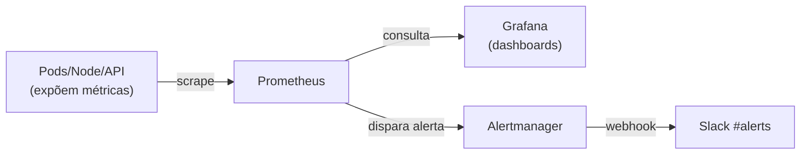

# Aula 12 — Observabilidade: métricas com Prometheus, Grafana e Alertmanager

[⬅ Aula anterior](11-cd-argocd-image-updater.md) | [Índice](00-indice.md) | [Próxima aula ➡](13-observabilidade-logs-eck-kibana.md)

## Objetivos

- Entender por que observabilidade é indispensável (você não pode confiar no que não vê).
- Entender os três pilares de observabilidade e onde métricas se encaixam.
- Instalar e configurar o `kube-prometheus-stack` (Prometheus + Grafana + Alertmanager).
- Configurar alertas no Slack e expor Grafana/Prometheus via Gateway API.

## Conceito

### Por que observabilidade — e por que ela fica FORA do GitOps do app

Depois das aulas 09-11, a aplicação se implanta e atualiza sozinha. Mas isso levanta uma
pergunta: **como saber se ela está saudável?** Um Pod pode estar `Running` e mesmo assim
responder erros 500, ou consumir memória crescente até um `OOMKill`.

**Observabilidade** é a capacidade de responder perguntas sobre o comportamento interno do
sistema a partir de sinais externos (métricas, logs, traces). Os três pilares clássicos:

| Pilar | Pergunta que responde | Ferramenta neste projeto |
|---|---|---|
| **Métricas** | "Quanto?" (CPU, latência, taxa de erro, réplicas) | Prometheus + Grafana |
| **Logs** | "O que aconteceu, em detalhe, neste evento?" | Elastic (ECK) + Kibana — aula 13 |
| **Traces** | "Por onde a requisição passou entre serviços?" | (Suportado via `opentelemetryCollector` no Helm chart, não coberto em profundidade aqui) |

> [!IMPORTANTE]
> O `README.md` deste projeto observa algo interessante de arquitetura organizacional: **a
> stack de observabilidade não é gerenciada pelo Argo CD** junto com a aplicação. O motivo:
> qualquer pessoa com acesso ao Argo CD (que gerencia o *app*) poderia, em tese, alterar
> configurações de monitoramento e "esconder" problemas (ex.: desabilitar um alerta antes de
> causar um incidente). Manter observabilidade **fora** do domínio de quem sobe/desce a
> aplicação é uma separação de responsabilidades e de confiança — parecido com o motivo de,
> em empresas reais, times de aplicação não terem acesso de escrita direto no Datadog/New
> Relic da infraestrutura.

### Prometheus, Grafana e Alertmanager — o que cada um faz

- **Prometheus**: banco de dados de séries temporais que **coleta (scrape)** métricas
  expostas por aplicações e pelo próprio Kubernetes, em intervalos regulares.
- **Grafana**: camada de visualização — dashboards e gráficos sobre os dados do Prometheus.
- **Alertmanager**: recebe alertas do Prometheus (quando uma condição de `PrometheusRule` é
  violada) e decide **para quem** e **como** notificar (aqui, Slack).



### Como o roteamento de alertas funciona

O arquivo de valores em `observability/helm-values/kube-prom-stack-81.6.3.yaml` configura o
Alertmanager assim:

```yaml
alertmanager:
  alertmanagerSpec:
    secrets:
      - alertmanager-slack-webhook   # secret do K8s montado no pod, nunca em texto puro
  config:
    route:
      group_by: ['namespace']
      group_wait: 30s
      group_interval: 5m
      repeat_interval: 12h
      receiver: 'slack-notification'
      routes:
      - receiver: 'slack-notification'
        matchers:
          - severity = "critical"
    receivers:
    - name: 'slack-notification'
      slack_configs:
        - api_url_file: /etc/alertmanager/secrets/alertmanager-slack-webhook/slack-webhook-url
          channel: '#alerts'
          send_resolved: true
```

O fluxo completo, do gatilho até a notificação:

1. Uma `PrometheusRule` (já vem com o `kube-prometheus-stack`) define uma condição, por
   exemplo: "se `kube_pod_container_status_restarts_total` aumentar mais de 5x em 5 minutos,
   dispare um alerta com `severity: critical`".
2. O **Prometheus** avalia essa regra continuamente; quando verdadeira, envia o alerta ao
   **Alertmanager**.
3. O **Alertmanager** olha as `routes`: como o alerta tem `severity="critical"`, ele bate no
   matcher e vai para o receiver `slack-notification`.
4. O Alertmanager lê a URL do webhook do Slack a partir de um **arquivo montado de um Secret
   do Kubernetes** (`api_url_file`), nunca de um valor em texto puro no `values.yaml` — uma
   prática de segurança que evita vazar a URL do webhook (qualquer pessoa com essa URL pode
   postar mensagens no seu canal do Slack).
5. `send_resolved: true` faz o Slack também receber um aviso quando o alerta se resolve — não
   só quando dispara.

> [!IMPORTANTE]
> Quem decide o que é "crítico" é a **regra do Prometheus** (`severity: critical` no label do
> alerta) — o Alertmanager só **roteia** com base nesse label, ele não julga severidade.

## Na prática, neste repositório

### 1. Configurar o webhook do Slack como Secret (nunca em texto puro)

```bash
kubectl create ns monitoring
kubectl create secret generic alertmanager-slack-webhook \
  --from-literal=slack-webhook-url="<sua URL de webhook do Slack>" \
  -n monitoring
```

### 2. Instalar o kube-prometheus-stack

```bash
helm repo add prometheus-community https://prometheus-community.github.io/helm-charts
helm show values prometheus-community/kube-prometheus-stack --version 81.6.3 \
  > observability/helm-values/kube-prom-stack-81.6.3.yaml
# edite o arquivo conforme mostrado acima (secrets + config do Alertmanager)

helm upgrade -i kube-prometheus-stack prometheus-community/kube-prometheus-stack \
  --version 81.6.3 -f observability/helm-values/kube-prom-stack-81.6.3.yaml -n monitoring
```

### 3. Expor Grafana e Prometheus via Gateway API

Reaproveitando exatamente o padrão da aula 06 (`HTTPRoute` + `TargetGroupConfiguration`):

[observability/HTTProute-grafana.yaml](../../observability/HTTProute-grafana.yaml) →
`grafana.devopsdock.site` → Service `kube-prometheus-stack-grafana:80`.

[observability/HTTProute-prometheus.yaml](../../observability/HTTProute-prometheus.yaml) →
`prometheus.devopsdock.site` → Service `kube-prometheus-stack-prometheus:9090`.

```bash
kubectl apply -f observability/HTTProute-grafana.yaml
kubectl apply -f observability/target-grp-grafana.yaml
kubectl apply -f observability/HTTProute-prometheus.yaml
kubectl apply -f observability/target-grp-prometheus.yaml
```

### 4. Acessar

```bash
kubectl --namespace monitoring get secrets kube-prometheus-stack-grafana \
  -o jsonpath="{.data.admin-password}" | base64 -d
```

Acesse `grafana.devopsdock.site` (usuário `admin`) e explore os dashboards pré-criados;
acesse `prometheus.devopsdock.site` para consultar métricas brutas (PromQL).

## Checklist

- [ ] Eu sei explicar os três pilares de observabilidade e qual ferramenta cobre cada um aqui.
- [ ] Eu sei por que a stack de observabilidade fica fora do GitOps do app neste projeto.
- [ ] Eu sei explicar o fluxo completo: regra do Prometheus → alerta → Alertmanager → Slack.
- [ ] Eu sei por que o webhook do Slack fica em um Secret do Kubernetes, não em `values.yaml`.

## Próxima aula

[Aula 13 — Observabilidade: logs com ECK e Kibana ➡](13-observabilidade-logs-eck-kibana.md)
