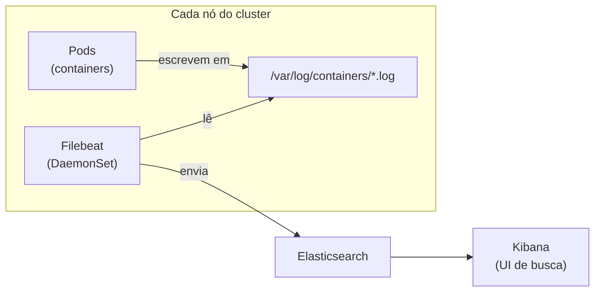

# Aula 13 — Observabilidade: logs com ECK (Elasticsearch, Filebeat, Kibana)

[⬅ Aula anterior](12-observabilidade-metricas-prometheus-grafana.md) | [Índice](00-indice.md) | [Próxima aula ➡](14-escalabilidade-hpa.md)

## Objetivos

- Entender por que métricas sozinhas não bastam — e o papel dos logs centralizados.
- Entender o papel de cada peça da stack: Elasticsearch, Filebeat, Kibana, ECK Operator.
- Entender por que logging com Elasticsearch precisa de armazenamento persistente (EBS CSI).
- Explorar logs de um serviço específico no Kibana.

## Conceito

### Por que centralizar logs

Com 11 microsserviços rodando em múltiplos Pods (e potencialmente múltiplos nós), "entrar no
Pod e olhar o log" não escala: um Pod pode ter sido substituído há muito tempo quando você for
investigar um incidente. **Logging centralizado** coleta os logs de todos os Pods,
independente de onde rodam, e os torna pesquisáveis em um só lugar — mesmo depois que o Pod
original já não existe mais.

### As peças da stack (padrão "EFK", aqui via ECK)

| Componente | Papel |
|---|---|
| **ECK Operator** | Operator do Kubernetes que gerencia o ciclo de vida de Elasticsearch/Kibana/Beats como CRDs. |
| **Elasticsearch** | Banco de dados de busca onde os logs ficam armazenados e indexados. |
| **Filebeat** (um "Beat") | Agente que roda em **todo nó** (DaemonSet) e envia os logs dos containers para o Elasticsearch. |
| **Kibana** | Interface web para buscar, filtrar e visualizar os logs no Elasticsearch. |



### Por que precisamos do EBS CSI Driver

O Elasticsearch **precisa de armazenamento persistente em disco** (índices de busca não cabem
só na memória, e não podem ser perdidos a cada restart do Pod). No EKS, isso significa
provisionar volumes EBS (Elastic Block Store) dinamicamente — o que exige o addon
**aws-ebs-csi-driver** (CSI = Container Storage Interface, a forma padrão do Kubernetes falar
com sistemas de armazenamento externos).

O [observability/storageclass.yaml](../../observability/storageclass.yaml) declara essa
`StorageClass` como padrão do cluster:

```yaml
apiVersion: storage.k8s.io/v1
kind: StorageClass
metadata:
  name: ebs-aws
  annotations:
    storageclass.kubernetes.io/is-default-class: "true"
provisioner: ebs.csi.aws.com
reclaimPolicy: Delete
volumeBindingMode: WaitForFirstConsumer
```

- `provisioner: ebs.csi.aws.com` → toda vez que um `PersistentVolumeClaim` pedir esse
  `StorageClass`, o driver cria um volume EBS real na AWS automaticamente.
- `volumeBindingMode: WaitForFirstConsumer` → o volume só é criado **depois** que o Pod que
  vai usá-lo for agendado — isso garante que o volume nasça na mesma zona de disponibilidade
  do nó, evitando erros de anexação entre AZs diferentes.

### Autodiscovery do Filebeat (o "cérebro" da coleta)

Em vez de configurar manualmente de onde ler logs de cada serviço, o Filebeat usa
**autodiscover** baseado na API do Kubernetes: ele observa Pods sendo criados/removidos e
automaticamente começa/para de coletar os logs deles, enriquecendo cada entrada com metadados
(`namespace`, `pod`, `container`, labels da aplicação):

```yaml
config:
  filebeat:
    autodiscover:
      providers:
      - node: ${NODE_NAME}
        type: kubernetes
        hints:
          enabled: true
```

Isso é o que permite, no Kibana, filtrar logs por `kubernetes.namespace` ou por qualquer label
da aplicação (ex.: `app: frontend`) sem nenhuma configuração manual por serviço.

## Na prática, neste repositório

### 1. Garantir o EBS CSI driver

```bash
eksctl create iamserviceaccount \
  --cluster terraform-cluster --namespace kube-system --name ebs-csi-controller-sa \
  --attach-policy-arn arn:aws:iam::aws:policy/service-role/AmazonEBSCSIDriverPolicy \
  --approve

eksctl create addon --cluster terraform-cluster --name aws-ebs-csi-driver --version latest \
  --service-account-role-arn <ARN do role criado acima> --force
```

### 2. Instalar o ECK Operator e a StorageClass

```bash
kubectl create ns logging
helm repo add elastic https://helm.elastic.co
helm install eck-operator elastic/eck-operator --version 3.3.0 -n logging

kubectl apply -f observability/storageclass.yaml
```

### 3. Instalar Elasticsearch, Filebeat e Kibana (via CRDs geridos pelo operator)

```bash
helm install eck-elasticsearch elastic/eck-elasticsearch --version 0.18.0 -n logging

helm show values elastic/eck-beats --version 0.18.0 > observability/helm-values/eck-beats-0.18.0.yaml
# editar conforme o README (elasticsearchRef, autodiscover, RBAC do ClusterRole)
helm upgrade -i eck-beats elastic/eck-beats --version 0.18.0 \
  -f observability/helm-values/eck-beats-0.18.0.yaml -n logging

helm show values elastic/eck-kibana --version 0.18.0 > observability/helm-values/eck-kibana-0.18.0.yaml
# editar: elasticsearchRef.name = eck-elasticsearch
helm install eck-kibana elastic/eck-kibana --version 0.18.0 \
  -f observability/helm-values/eck-kibana-0.18.0.yaml -n logging
```

Verifique os CRDs geridos pelo operator (não são Deployments comuns):

```bash
kubectl get elasticsearch -n logging
kubectl get beats -n logging
kubectl get kibana -n logging
kubectl get pv    # confirme que o EBS CSI provisionou um volume dinamicamente
```

### 4. Expor o Kibana e buscar logs

Mesmo padrão de sempre (`HTTPRoute` + `TargetGroupConfiguration`, aula 06), agora com um
detalhe extra: o
[observability/target-grp-kibana.yaml](../../observability/target-grp-kibana.yaml) inclui um
health check HTTPS explícito, porque o Kibana serve por TLS internamente:

```yaml
spec:
  targetReference:
    name: eck-kibana-kb-http
  defaultConfiguration:
    targetType: ip
    protocol: HTTPS
    healthCheckConfig:
      healthCheckProtocol: HTTPS
      healthCheckPath: /api/status
```

```bash
kubectl apply -f observability/HTTProute-kibana.yaml
kubectl apply -f observability/target-grp-kibana.yaml

kubectl get secret eck-elasticsearch-es-elastic-user -n logging \
  -o go-template='{{.data.elastic | base64decode}}'
```

Acesse `kibana.devopsdock.site` (usuário `elastic`), vá em **Discover**, filtre por
`kubernetes.namespace: boutique-app` e depois por `kubernetes.labels.app: frontend` para ver
só os logs desse serviço.

## Checklist

- [ ] Eu sei o papel de cada peça: ECK Operator, Elasticsearch, Filebeat, Kibana.
- [ ] Eu sei por que o Elasticsearch precisa de um `PersistentVolume` via EBS CSI driver.
- [ ] Eu sei o que `WaitForFirstConsumer` resolve na `StorageClass`.
- [ ] Eu sei explicar como o Filebeat descobre automaticamente logs de novos Pods
      (autodiscover + hints).

## Próxima aula

[Aula 14 — Escalabilidade: HPA ➡](14-escalabilidade-hpa.md)
