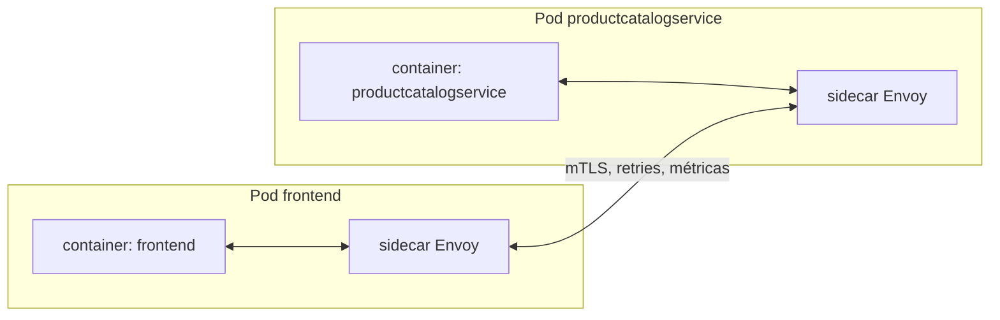

# Aula 15 — Service Mesh com Istio

[⬅ Aula anterior](14-escalabilidade-hpa.md) | [Índice](00-indice.md) | [Próxima aula ➡](16-seguranca-boas-praticas.md)

## Objetivos

- Entender o que é um service mesh e que problema ele resolve além do que Kubernetes já dá.
- Entender `Gateway`, `VirtualService` e `ServiceEntry` do Istio.
- Ler os manifests de Istio deste projeto e entender como ativá-los via Kustomize.
- Entender quando vale a pena adotar um service mesh (e quando não vale).

## Conceito

### O que Kubernetes já resolve — e o que falta

Você já viu que o `Service` do Kubernetes dá descoberta de nome e um IP estável (aula 04), e
que a Gateway API + AWS ALB cuida da entrada de tráfego externo (aula 06). Mas, para tráfego
**entre serviços dentro do cluster** (leste-oeste), Kubernetes puro não oferece nativamente:

- Criptografia automática entre serviços (mTLS).
- Políticas refinadas de autorização (quem pode chamar quem).
- Controle de rota mais rico (canary releases, espelhamento de tráfego, retries/timeouts por
  rota) sem mudar código da aplicação.
- Observabilidade de tráfego uniforme entre serviços (métricas de chamadas gRPC/HTTP
  entre serviços, independente da linguagem de cada um).

Um **service mesh** como o **Istio** resolve isso injetando um proxy (`sidecar`, o Envoy) ao
lado de cada Pod, que intercepta todo o tráfego de rede — sem precisar alterar o código da
aplicação em Go, Python, C#, Java, Node etc.



### Os objetos do Istio usados neste projeto

| Objeto | Papel |
|---|---|
| `Gateway` (Istio) | Define um ponto de entrada de tráfego **gerido pelo próprio Istio** (`istio-ingressgateway`) — equivalente conceitual ao `Gateway` da Gateway API (aula 06), mas implementado pelo Istio em vez do AWS Load Balancer Controller. |
| `VirtualService` | Define **para onde** rotear tráfego que chega em um `Gateway` (ou tráfego interno) — equivalente conceitual ao `HTTPRoute`. |
| `ServiceEntry` | Registra hosts **externos** ao mesh (fora do cluster) para que o Istio saiba permitir/rotear tráfego de saída (egress) até eles. |

[istio-manifests/frontend-gateway.yaml](../../istio-manifests/frontend-gateway.yaml) — cria um
`Gateway` do Istio e uma `VirtualService` associada, expondo o `frontend` publicamente através
do ingress gateway do Istio:

```yaml
apiVersion: networking.istio.io/v1alpha3
kind: Gateway
metadata:
  name: frontend-gateway
spec:
  selector:
    istio: ingressgateway
  servers:
  - port: { number: 80, name: http, protocol: HTTP }
    hosts: ["*"]
---
apiVersion: networking.istio.io/v1alpha3
kind: VirtualService
metadata:
  name: frontend-ingress
spec:
  hosts: ["*"]
  gateways: [frontend-gateway]
  http:
  - route:
    - destination: { host: frontend, port: { number: 80 } }
```

[istio-manifests/frontend.yaml](../../istio-manifests/frontend.yaml) — uma segunda
`VirtualService`, mais simples, para tráfego **interno** ao mesh
(`frontend.default.svc.cluster.local`), sem depender de um `Gateway` de entrada.

[istio-manifests/allow-egress-googleapis.yaml](../../istio-manifests/allow-egress-googleapis.yaml)
— por padrão, um mesh Istio bem configurado **bloqueia tráfego de saída não declarado**
explicitamente (postura "deny by default", ver aula 16). Como algumas partes deste
projeto/derivados dependem de APIs do Google (ex.: `accounts.google.com`, `*.googleapis.com`,
metadata server), esse `ServiceEntry` libera explicitamente esses destinos:

```yaml
apiVersion: networking.istio.io/v1alpha3
kind: ServiceEntry
metadata:
  name: allow-egress-googleapis
spec:
  hosts:
  - "accounts.google.com"
  - "*.googleapis.com"
  ports:
  - { number: 443, protocol: HTTPS, name: https }
```

> [!IMPORTANTE]
> Esse é um ótimo exemplo do princípio de **allowlist explícita**: em vez de permitir todo
> tráfego de saída por padrão (mais fácil, porém mais arriscado), o mesh só permite o que foi
> declarado — reduzindo a chance de um serviço comprometido "vazar" dados para um destino
> arbitrário na internet. Retomamos esse tema na aula 16.

### Como ativar Istio neste projeto (via Kustomize)

Lembrando da aula 07: existe um component pronto,
[kustomize/components/service-mesh-istio/](../../kustomize/components/service-mesh-istio),
que agrupa exatamente esses três manifests. Para habilitá-lo:

```yaml
# kustomize/kustomization.yaml
components:
- components/service-mesh-istio
```

```bash
kubectl kustomize kustomize/    # confira o resultado renderizado
kubectl apply -k kustomize/
```

E, no Helm chart (aula 08), a flag `authorizationPolicies.create: true` em
[helm-chart/values.yaml](../../helm-chart/values.yaml) passa a gerar `AuthorizationPolicy`
(`deny-all` por padrão) por serviço, complementando o mesh com controle de acesso.

### Quando vale a pena um service mesh?

Um service mesh adiciona complexidade operacional real (mais um componente para
instalar/atualizar, sidecars consumindo CPU/memória extra em cada Pod, curva de aprendizado).
Costuma valer a pena quando você precisa de mTLS automático entre dezenas/centenas de
serviços, políticas de autorização granulares, ou traffic shaping avançado (canary, blue-green
no nível de rede) — não é um requisito universal para toda aplicação com poucos serviços.

## Na prática, neste repositório

1. Instale o Istio em um cluster de teste (`istioctl install --set profile=demo -y`).
2. Habilite o component `service-mesh-istio` no `kustomize/kustomization.yaml` e aplique.
3. Rode `kubectl get pods -n boutique-app` e note a coluna `READY` mostrando `2/2` (aplicação +
   sidecar Envoy) em vez de `1/1`.
4. Compare mentalmente: o `frontend-gateway.yaml` do Istio (aqui) faz um papel parecido com o
   `gateway.yaml` da AWS Gateway API (aula 06) — mas são implementações concorrentes/
   alternativas, não usadas simultaneamente na mesma rota de produção deste projeto.

## Checklist

- [ ] Eu sei o que um sidecar Envoy faz e por que ele não exige mudança de código da aplicação.
- [ ] Eu sei a diferença entre `Gateway`+`VirtualService` (Istio) e `Gateway`+`HTTPRoute`
      (Gateway API/AWS LBC) — dois padrões parecidos, implementações diferentes.
- [ ] Eu sei o que um `ServiceEntry` faz e por que a postura "deny by default" no egress é
      mais segura.
- [ ] Eu sei como habilitar o Istio neste projeto via component do Kustomize.

## Próxima aula

[Aula 16 — Segurança e boas práticas ➡](16-seguranca-boas-praticas.md)
