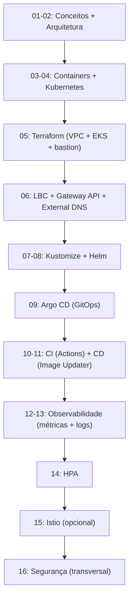

# Aula 17 — Projeto final e próximos passos

[⬅ Aula anterior](16-seguranca-boas-praticas.md) | [Índice](00-indice.md)

## Objetivos

- Consolidar tudo o que foi visto em um exercício prático de ponta a ponta.
- Adicionar um novo microsserviço seguindo o fluxo completo (código → CI → CD → observado).
- Fazer o cleanup correto da infraestrutura.
- Ter um roadmap claro de temas avançados para continuar evoluindo depois deste curso.

## Recapitulando a jornada



Você percorreu, na prática, o mesmo caminho que uma plataforma de engenharia percorre ao
amadurecer: da aplicação rodando em um Pod isolado até uma esteira GitOps completa, observável
e (parcialmente) endurecida contra falhas de segurança.

## Projeto final (capstone): adicionar um novo microsserviço

Este é o exercício mais completo do curso — ele força você a tocar em praticamente todas as
camadas estudadas. O próprio projeto já documenta o processo "puro" (sem GitOps) em
[docs/adding-new-microservice.md](../adding-new-microservice.md); seu desafio é fazer a
versão **completa**, integrada à esteira GitOps deste repositório:

1. **Código** (aula 02/03): crie um serviço simples (ex.: um `wishlistservice` que apenas
   retorna uma lista fixa de produtos "favoritos" via gRPC), com seu próprio `Dockerfile` em
   `src/wishlistservice/`.
2. **Kubernetes/Helm** (aulas 04/08): adicione um template em `helm-chart/templates/` seguindo
   o padrão dos serviços existentes (Deployment + Service + ServiceAccount, com
   `securityContext` restritivo como no `frontend`), e a seção correspondente em
   `helm-chart/values.yaml` (imagem, resources).
3. **CI** (aula 10): confirme que o `ci-trigger.yaml` detecta a nova pasta `src/wishlistservice`
   automaticamente (sem precisar editar o workflow) e builda/escaneia/publica a imagem.
4. **CD** (aula 11): adicione um novo item `images` no `argocd/image-updater.yaml` para o
   `wishlistservice`.
5. **GitOps** (aula 09): dê commit/push — **nunca** `kubectl apply` manual — e observe o Argo
   CD sincronizar o novo serviço.
6. **Observabilidade** (aulas 12/13): confirme que os logs do novo serviço aparecem no Kibana
   filtrando por `app: wishlistservice`, e que ele aparece em `kubectl top pods`.
7. **Escalabilidade** (aula 14): crie um HPA simples para ele.
8. **Segurança** (aula 16): revise se o novo Deployment segue o mesmo padrão de
   `securityContext` restritivo dos demais.

Esse exercício "fecha o círculo": você usa a mesma esteira construída nas aulas 01-16 para
entregar uma mudança real, do commit à observação em produção.

## Cleanup: não deixe recursos da AWS rodando

Infraestrutura provisionada por Terraform **gera custo enquanto existir**. Ao terminar seus
testes:

1. Delete manualmente, pelo console da AWS, o(s) Load Balancer(s) e seus Security Groups
   criados pelo AWS Load Balancer Controller (o Terraform não sabe gerenciá-los, pois foram
   criados pelo controller, não diretamente por `.tf`).
2. Rode, na mesma máquina/diretório onde você rodou `terraform apply`:
   ```bash
   cd terraform/
   terraform destroy -auto-approve
   ```
3. Confirme no console da AWS que VPC, EKS e instâncias EC2 (bastion, node group) foram
   removidos.

> [!IMPORTANTE]
> Sempre destrua ambientes de estudo/teste. Um cluster EKS ocioso, node groups em EC2 e Load
> Balancers da AWS cobram por hora, independente de uso.

## Roadmap: para onde ir depois deste curso

Este projeto já é avançado, mas um ambiente de produção real de uma empresa normalmente vai
além. Alguns temas para você explorar em seguida, cada um construindo sobre o que você já
aprendeu:

| Tema | Por que é o próximo passo natural |
|---|---|
| **Múltiplos ambientes (dev/staging/prod)** | Você já sabe Kustomize (aula 07) — o próximo passo é overlays por ambiente, cada um com seu próprio `kustomization.yaml`/values. |
| **Argo CD `ApplicationSet`** | Em vez de uma `Application` por serviço/ambiente, gerar várias a partir de um único template — essencial quando você tem múltiplos clusters/ambientes. |
| **Gerenciamento de segredos dedicado** | Trocar `Secret`s "manuais" (aula 16) por [External Secrets Operator](https://external-secrets.io/) + AWS Secrets Manager, ou [Sealed Secrets](https://github.com/bitnami-labs/sealed-secrets). |
| **Policy as Code** | Ferramentas como [OPA/Gatekeeper](https://open-policy-agent.github.io/gatekeeper/) ou [Kyverno](https://kyverno.io/) para impor automaticamente as boas práticas da aula 16 (ex.: "todo Deployment precisa de `runAsNonRoot: true`") como regra do cluster, não só como convenção. |
| **Tracing distribuído** | Habilitar de fato o `opentelemetryCollector` (já existe no `values.yaml`, `create: false` por padrão) e visualizar traces ponta a ponta entre os 11 serviços. |
| **Testes automatizados de infraestrutura** | `terraform plan` em CI, testes de manifests Kubernetes (`kubeconform`, `conftest`), testes de contrato para os `.proto`. |
| **Disaster recovery / backups** | Backup do Redis do carrinho, backup do Elasticsearch, múltiplas AZs para o NAT Gateway (lembra da troca de custo x resiliência da aula 05?). |
| **Custo (FinOps)** | Métricas de custo por namespace/serviço, `Karpenter` para autoscaling de nós mais eficiente que Node Groups fixos. |
| **Chaos engineering** | Ferramentas como [Chaos Mesh](https://chaos-mesh.org/) para testar deliberadamente a resiliência que você construiu (o que acontece se `cartservice` cair? o HPA reage bem a picos súbitos?). |

## Encerramento

Você percorreu, com um único projeto real como referência, toda a cadeia de valor de DevOps
moderno: da ideia de "por que automatizar" até uma plataforma com IaC, GitOps, CI/CD,
observabilidade, autoscaling, service mesh e uma revisão de segurança. Esse é o mesmo conjunto
de competências que sustenta plataformas de engenharia em empresas de todos os tamanhos —
a diferença entre este laboratório e produção real é principalmente escala e
governança, não conceitos novos.

[⬅ Aula anterior](16-seguranca-boas-praticas.md) | [Voltar ao índice](00-indice.md)
